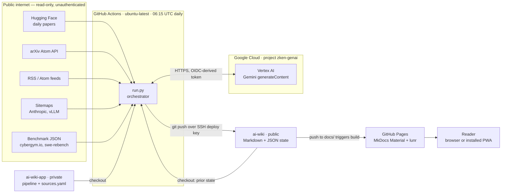
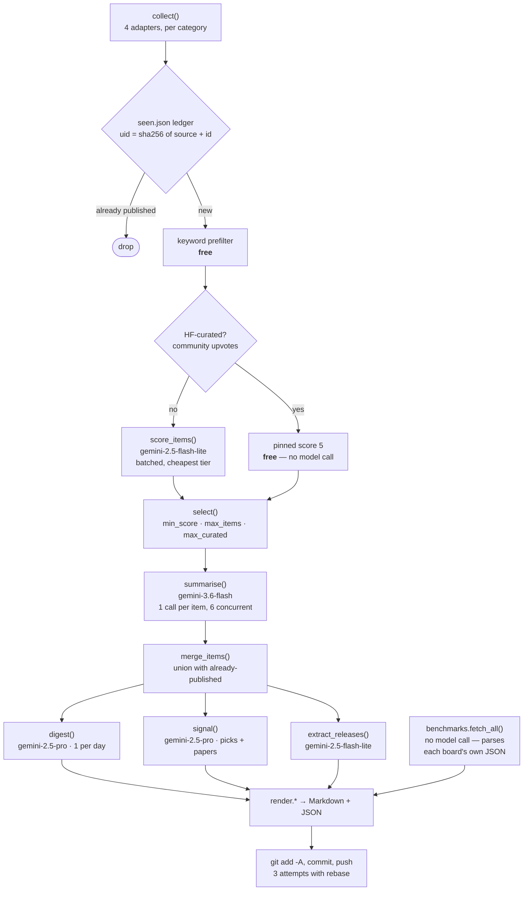
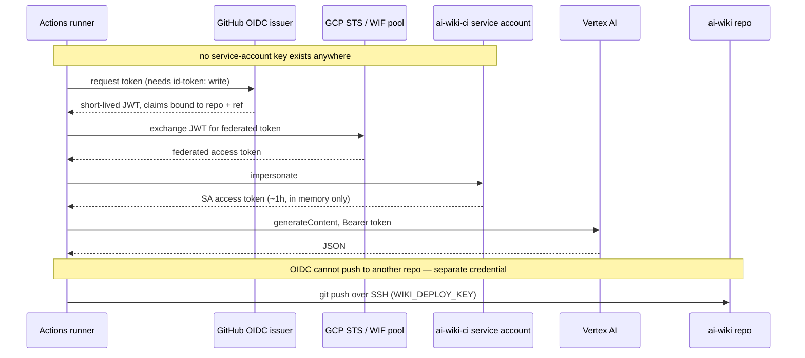

# ai-wiki-app

Pipeline that builds [zken-cloud/ai-wiki](https://github.com/zken-cloud/ai-wiki).
Runs daily in GitHub Actions, writes Markdown into the wiki repo, and pushes.

```
collect ──► dedupe ──► triage ──► summarise ──► render ──► commit to ai-wiki
(4 source   (seen     (keyword +  (Gemini      (Markdown
 types)      ledger)   Gemini)     Flash)       + JSON)
```

## Architecture

### System overview

There is no server and no database. A scheduled GitHub Actions job is the only
compute; two git repos are the only storage. Everything is either free or
billed per token.



### Data pipeline

One pass per date, per category. The ordering is the cost control: every free
stage runs before any paid one, so the expensive per-item summaries only ever
see items that already qualified.



Two invariants worth knowing before changing any of this:

- **Re-running a date merges, never replaces.** `load_existing()` re-hydrates
  from `data/items/<date>.json` and `merge_items()` unions it with whatever is
  newly found. Without this, a partial re-run silently deletes content.
- **A failing source never fails the run.** Each adapter and each benchmark
  parser is wrapped; a dead feed logs and the run continues with the rest.

### Crawling

All fetching is plain HTTPS with `requests`, a 45s timeout, and an honest
identifying User-Agent (`ai-wiki/1.0 (+github.com/zken-cloud/ai-wiki)`). No
browser automation, no JS execution, no auth to any source, no login-walled
content. Sources that block honest bots are dropped rather than spoofed —
see the CISA note under Operational notes.

| Adapter | Fetches | Notes |
|---|---|---|
| `hf_daily` | Hugging Face daily-papers JSON | Upvotes are a free relevance signal |
| `arxiv` | arXiv Atom API, per category | **Rate-limited to 1 req / 3s** with retry+backoff; arXiv 429s aggressively and silently loses coverage otherwise. Date ranges must go through `params=` so brackets are encoded |
| `rss` | Any RSS/Atom feed | `feedparser`, tolerant of malformed XML |
| `sitemap` | `sitemap.xml` + each page | For publishers with no feed (Anthropic). `path_contains` + `max_pages` bound the crawl |
| `benchmarks` | Each board's own structured JSON | Reads the same file the site renders client-side — far more stable than scraping the DOM |

Identity is `uid = sha256(source_type + stable_id)[:16]`, where the stable id is
the arXiv id or the canonical URL — not the title, which publishers edit.

### Storage

State lives in the **public wiki repo**, committed alongside the content it
describes, because Actions runners are stateless and this keeps the whole
history auditable in one place. Nothing is stored in the private app repo but
code and config.

```
ai-wiki/
├── docs/                     # published output — what MkDocs builds
│   ├── index.md              #   Today's Signal (PWA launch target)
│   ├── models.md             #   Model Tracker
│   ├── benchmarks.md         #   Benchmark Arena
│   ├── daily/<date>.md       #   long-form briefings
│   ├── {papers,security,infra,vendors}/<date>.md
│   ├── manifest.webmanifest  # PWA
│   └── sw.js                 #   service worker
└── data/                     # machine state — inputs to the next run
    ├── seen.json             #   dedupe ledger, uid → first-seen date, 120d retention
    ├── items/<date>.json     #   per-day items; re-hydrated so re-runs merge
    ├── signal/<date>.json    #   the day's brief, so a no-op run can skip regenerating
    ├── models.json           #   accumulated model releases
    └── benchmarks.json       #   latest leaderboard snapshots
```

`data/` is deliberately committed and public: it is the pipeline's only memory,
and losing it would mean re-publishing everything already seen.

### Secrets and trust boundaries

The job authenticates two different ways, to two different systems, and holds
exactly **one** long-lived credential.



| Name | Kind | Scope | Why |
|---|---|---|---|
| `GCP_WIF_PROVIDER` | repo **variable** | — | Identifies the WIF pool; not sensitive |
| `GCP_SERVICE_ACCOUNT` | repo **variable** | — | The SA to impersonate; not sensitive |
| `GCP_PROJECT`, `GCP_LOCATION` | repo **variables** | — | Target project / region, default `global` |
| `WIKI_DEPLOY_KEY` | repo **secret** | write on `zken-cloud/ai-wiki` only | The one stored credential. A deploy key, not a PAT: it reaches exactly one repo, has no account-wide access, and cannot be used to read anything else |
| `GITHUB_TOKEN` | injected | `pages: write` in the wiki repo | Only the Pages deploy uses it |

Boundaries this design maintains:

- **No GCP key material at rest.** Vertex access is minted per run from the
  OIDC token and expires on its own.
- **Least privilege in the workflow.** `daily.yml` requests only
  `contents: read` + `id-token: write` — it cannot write its own repo.
- **The private repo stays private.** Only rendered content is pushed to the
  public repo; `sources.yaml` and the pipeline are never copied there.
- **Dry runs need no push credential.** The wiki checkout is skipped when
  `dry_run=true`, so WIF can be validated end-to-end without `WIKI_DEPLOY_KEY`.

### Publishing

A push touching `docs/` in the wiki repo triggers `pages.yml`, which runs
`mkdocs build --strict` and deploys the artifact to GitHub Pages. Search is
lunr, built into the static bundle at build time — client-side, no query
backend, no cost. The PWA layer (`manifest.webmanifest` + `sw.js`, injected via
`overrides/main.html`) makes it installable and readable offline.

## Why it is shaped this way

- **Content lives in a separate public repo.** The wiki stays readable Markdown
  you can browse on GitHub or move elsewhere; this repo holds the machinery.
- **Cost is controlled by ordering the funnel cheapest-first.** A free keyword
  prefilter and the Hugging Face curated-bypass run before any paid call, so
  the expensive per-item summaries only ever see items that already qualified.
- **One config file is the extension point.** Adding sources or whole
  categories should never require touching Python.

## Extending it

| You want to… | Do this |
|---|---|
| Add a feed to an existing category | Add an entry under that category's `sources:` in `sources.yaml` |
| Add a whole new category | Copy a `categories:` block in `sources.yaml`, then `mkdir wiki/docs/<id>` and add it to `nav:` in `wiki/mkdocs.yml` |
| Tune what gets through | Edit that category's `filter.min_score` / `keywords` / `max_items` |
| Change how items are judged | Edit that category's `criteria:` — it is passed verbatim to the scoring model |
| Support a new *kind* of source | Add a function to `pipeline/collect.py` and register it in `ADAPTERS` |

### Source types

| Type | Use for | Notes |
|---|---|---|
| `hf_daily` | Hugging Face curated daily papers | Carries community upvotes, used as a free relevance signal |
| `arxiv` | arXiv Atom API, per category | Recall tier — catches what did not trend |
| `rss` | Any RSS/Atom feed | Parsed with `feedparser`, tolerant of malformed feeds |
| `sitemap` | Publishers with **no** feed | Reads `sitemap.xml`, fetches pages. This is how Anthropic is ingested — they publish no RSS |

## Local use

```bash
python3 -m venv .venv && .venv/bin/pip install -r requirements.txt
gcloud auth application-default login          # local credentials

.venv/bin/python run.py --check                # verify Vertex access
.venv/bin/python run.py --wiki ../ai-wiki --dry-run       # no writes, no summaries
.venv/bin/python run.py --wiki ../ai-wiki --only papers   # one category
.venv/bin/python run.py --wiki ../ai-wiki                 # full run
```

`--dry-run` still calls the (cheap) scoring model so you can see what *would*
be selected; it skips summaries, the digest, and all file writes.

## CI setup

1. Have a project admin run `scripts/setup-wif.sh`. It provisions keyless
   Workload Identity Federation — no service-account key is ever stored.
2. Set the repo variables it prints (`GCP_WIF_PROVIDER`, `GCP_SERVICE_ACCOUNT`,
   `GCP_PROJECT`).
3. Set one secret, `WIKI_DEPLOY_KEY`: the private half of an SSH deploy key
   whose public half is registered **write-enabled on `zken-cloud/ai-wiki`**.
   Cross-repo pushes have no OIDC equivalent, so this is the one stored
   credential — a deploy key is used rather than a PAT because it grants write
   to exactly one repo and has no reach over the account.

   To rotate it:
   ```bash
   ssh-keygen -t ed25519 -N "" -C "ai-wiki-app CI" -f /tmp/k
   gh api -X POST repos/zken-cloud/ai-wiki/keys -f title="ai-wiki-app CI" \
     -f key="$(cat /tmp/k.pub)" -F read_only=false
   gh secret set WIKI_DEPLOY_KEY -R zken-cloud/ai-wiki-app < /tmp/k
   rm /tmp/k /tmp/k.pub          # then delete the old key from the repo's Deploy keys
   ```

## Operational notes

- **Dedupe ledger** lives at `ai-wiki/data/seen.json`, committed with the
  content it describes (Actions runners are stateless). Entries older than 120
  days are pruned automatically.
- **`window_days: 7`**, not 3. Several high-value publishers (NCSC, Google
  Security, Meta Engineering) post weekly; a 3-day window returned zero items
  from them. The ledger makes a wide window safe — nothing publishes twice.
- **Thinking is disabled** (`thinking_budget=0`) on the triage and summary
  calls. Gemini bills thinking against `maxOutputTokens`, which silently
  truncated structured JSON mid-string until this was set.
- **Models and region.** Summaries run on `gemini-3.6-flash`; triage stays on
  `gemini-2.5-flash-lite` and the digest on `gemini-2.5-pro`, because
  `gemini-3.6-pro` and `gemini-3.6-flash-lite` do not exist on Vertex (verified
  404). Region defaults to `global` via `GCP_LOCATION`. The global location
  uses the un-prefixed host `aiplatform.googleapis.com`, not
  `<region>-aiplatform.googleapis.com` — see `_endpoint()` in `pipeline/llm.py`.
- **Re-running a date merges, never replaces.** Pages are rebuilt from the union
  of what was already published (re-hydrated from `data/items/<date>.json`) and
  whatever is newly found.
- **A failing source never fails the run.** Each adapter is wrapped; a dead
  feed logs an error and the run continues.
- **CISA is deliberately excluded.** Its WAF rejects any non-browser
  User-Agent, and its content is overwhelmingly ICS advisories with no AI
  dimension — not worth spoofing a browser for.

## Cost

Per day, roughly: ~15 batched triage calls on Flash-Lite, ~65 summaries on
Flash, one digest on Pro. That is a few hundred thousand tokens/day, dominated
by cheap models. GitHub Actions and Pages are free at this volume.
